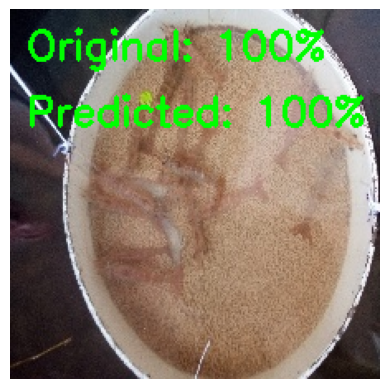
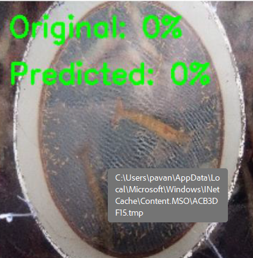

# 🦐 Shrimp Feed Consumption Estimation using Image Processing & Deep Learning

## 📘 Overview
This project focuses on estimating feed consumption percentage in aquaculture ponds by analyzing underwater images of shrimp feed trays.  
It helps farmers optimize feed usage, reduce waste, and maintain pond health through data-driven insights.

---

## 🎯 Objective
To automatically estimate the percentage of feed consumed by shrimps using image processing and deep learning techniques.

---

## ⚙️ Tech Stack
- **Language:** Python  
- **Platform:** Google Colab  
- **Libraries:** OpenCV, os, TensorFlow, sklearn, NumPy, Matplotlib  
- **Model:** ResNet50 (A convolutional neural network)  
- **Dataset:** Underwater feed tray images captured at different time intervals

---

## 🧩 Methodology
1. **Data Collection:** Captured underwater feed tray images at various feeding times.  
2. **Preprocessing:** Applied image enhancement and data augmentation techniques to improve dataset quality.  
3. **Segmentation:** Isolated feed tray areas from background using thresholding and contour detection.  
4. **Model Training:** Trained a CNN model to classify or estimate feed consumption percentage (e.g., 0%, 25%, 50%, 75%, 100%).  
5. **Evaluation:** Compared model predictions with actual feed levels to calculate accuracy.  

---

## 📊 Results
- Achieved an accuracy of **94.67%** on test images.  
- Model successfully differentiates between high and low feed consumption scenarios.  

Example output:

| Input Image | Predicted Feed Consumption |
|--------------|----------------------------|
|  | 100% |
|  | 0% |

---

## ▶️ How to Run
1. Open the notebook in **Google Colab**.  
2. Upload the dataset .  
3. Run all cells sequentially.  
4. View results in the `outputs/` folder or final cell outputs.

## 📂 Dataset
The dataset used for this project can be accessed from the following link:  
👉 [Download Dataset from Google Drive (Training Dataset)](https://drive.google.com/drive/folders/1w3ag-vvUQ_NhWiookjVN-D6g00w8K22O?usp=drive_link)
👉 [Data set for testing] (https://drive.google.com/drive/folders/1qWu6TxxlWT_BKI2uEGhJ8c0ZB7hLu4z4?usp=drive_link)
---

## 🌱 Future Enhancements
- Integrate real-time camera feed for live feed monitoring.  
- Develop a mobile/web dashboard for visual analytics.  

---

## 👩‍💻 Author
**Pavan Satya Prakash Adabala**  
B.Tech Information Technology  
Email: pavansatyaprakashadabala@example.com  
GitHub: [Pavan Adabala](https://github.com/PavanAdabala08)
